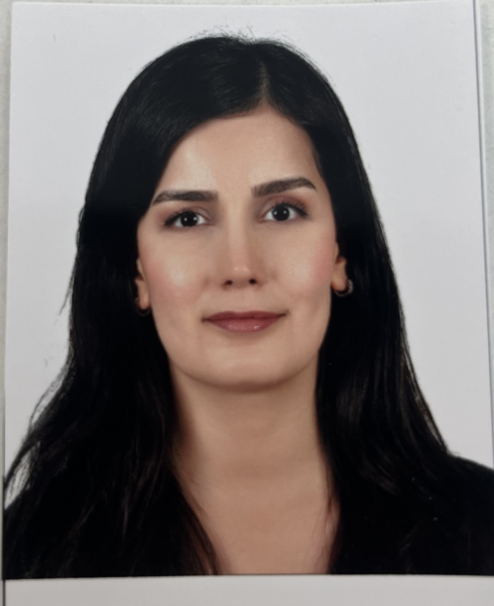

{fig-align="center" width="200"}

# Education

-   B.S., Industrial Engineering, Eskisehir Osmangazi University, Turkey, 2011 - 2017.
-   M.S., Industrial Engineering, Hacettepe University, Turkey, 2026 - ongoing.

## Employements

1.  Ministry of Health, Industrial Engineer, 2020-ongoing.

## Internships

1.  TULOMSAS, Intern in Production Planning, 2013 

2.  Ford Otosan, Intern in Production Planning, 2016

3.  Bisteks Textil, Intern in Marketing Management, 2017

